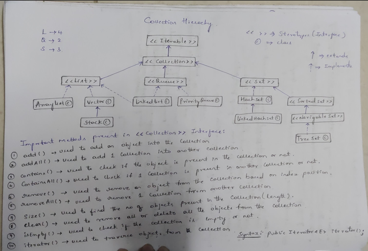

# `Collections`
---
## Data Structure
- DS is the way of storing the data or organising the data
- DS is the  arrangement of group of data
>EG: Stack, Queue, Arrays, LinkedList, Trees, Graphs
---
## Collection
- Collection is **pre-defined interface** present in **java.util** package
- Introduced from **JDK 1.2**
- Collection is used to store a **group of objects**.
---
# Collection Framework Hierarchy

---

# Array vs Collection 

| 🔍 **Aspect**               | 🧱 **Array**                                                                 | 📦 **Collection**                                                                 |
|----------------------------|------------------------------------------------------------------------------|-----------------------------------------------------------------------------------|
| **Size**                   | Fixed at the time of creation; can't grow or shrink dynamically.             | Dynamic; can grow or shrink based on requirements.                              |
| **Predefined Methods**     | Only basic operations (e.g., access via index, length).                      | Rich set of utility methods via Collection API (e.g., `add()`, `remove()`, `sort()`, `search()`). |
| **Nature**                 | Homogeneous and sequential, focused on raw storage.                         | Object-oriented and abstract; focuses on behavior and structure.                 |
| **Type Flexibility (Generics)** | Supports generics but not enforced explicitly.                              | Designed to work seamlessly with generics for type safety.                      |
| **Underlying Data Structure** | Array — contiguous memory block.                                            | Various: arrays, linked lists, trees, hash tables, heaps — depending on the implementation. |

>Collections are like Java’s power tools 🛠️ — Arrays are great, but Collections give you automation, speed settings, and precision control.
---