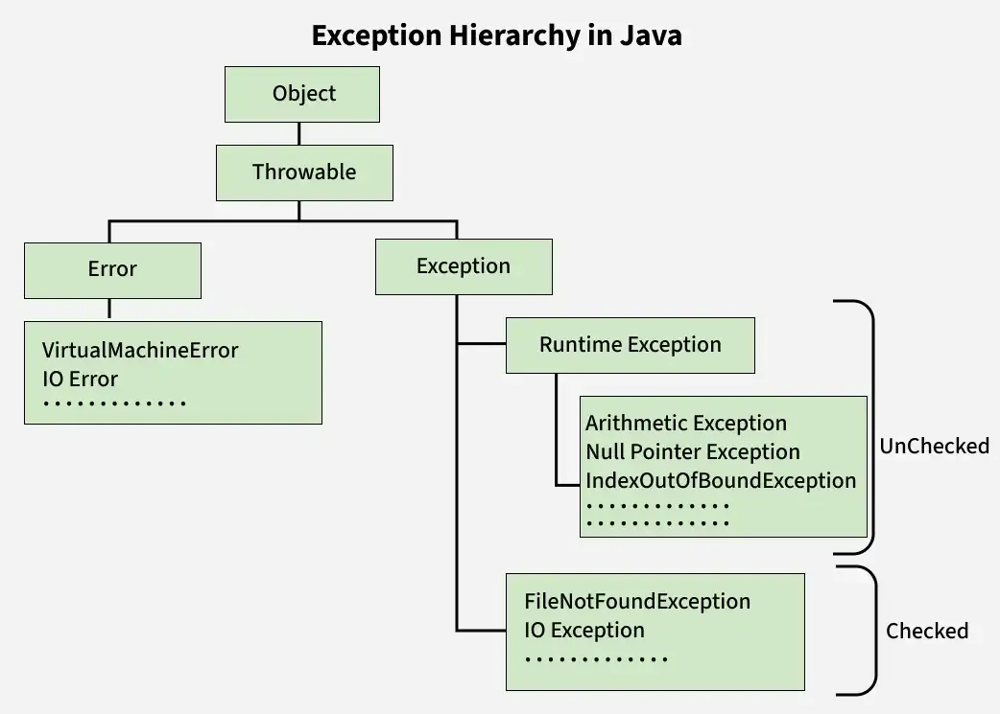

# 🎯 Exception Handling Hierarchy



---

## 🧱 Object & Throwable

- At the top of the Java exception hierarchy is the **`Object`** class, from which every class in Java inherits.
- Directly beneath `Object` is the **`Throwable`** class—this is the parent of both **Errors** and **Exceptions**.
- The `Throwable` class provides core exception-handling capabilities, like `printStackTrace()`.

### 🔀 `Throwable` is divided into:
1. **Error**
2. **Exception**

---

## ❌ Error

- Errors represent **serious problems** that a reasonable application **should not attempt to catch**.
- These issues are typically related to the **Java Virtual Machine (JVM)** or system-level failures.
- Example scenarios: out-of-memory, stack overflows, and JVM crashes.

---

## ⚠️ Exception

- The `Exception` class is the **base** for all recoverable, application-level issues.
- Exceptions indicate conditions that a program **might want to catch and handle**.
- These are further divided into:

    1. **Checked Exceptions** — Must be handled at compile-time using `try-catch` or declared with `throws`.
    2. **Unchecked Exceptions** — Runtime exceptions that aren’t checked during compilation and may be optionally handled.

---

# Checked Exception 

These are exceptions that are checked at compile-time. 
If you are writing a code that might throw a checked exception, then you must write additional code for exception handling; otherwise, the Java compiler would not allow your code to compile. The compiler ensures that the programmer handles these exceptions by either using a try-catch block or declaring them in the method signature with the throws keyword.

**Common checked exception**
1. IOException
2. FileNotFoundException

```java
import java.io.File;
import java.io.FileNotFoundException;
import java.util.Scanner;
class GfG {
    public static void main(String[] args) {
        // Example for checked
        Scanner scanner = new Scanner(new File("a.txt"));
        // The above code will not compile if we do not add exception handling code
        try {
            scanner = new Scanner(new File("a.txt"));
        } catch (FileNotFoundException e) {
            System.out.println("File not found: " + e.getMessage());
        }
    }
}
```
> In this example, the FileNotFoundException must be handled, or the code will not compile.
---