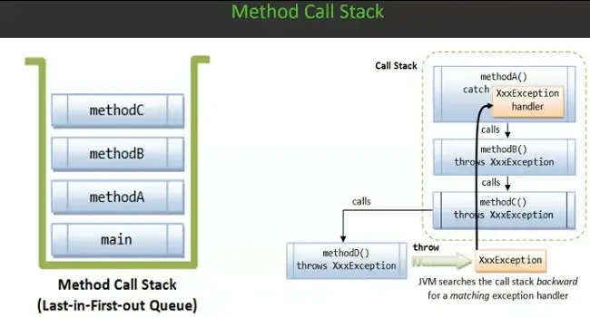

# 📌 Method Call Stack

The method call stack tracks the sequence of method invocations during program execution. Each time a method is called, a new stack frame is added to store its parameters and local variables. As methods complete, their frames are removed from the stack.

## 📚 Understanding the Method Call Stack in Java

The **method call stack** is a crucial part of Java's runtime system. It keeps track of method invocations and helps manage program execution in an organized manner.

## 🧱 What Is the Method Call Stack?

The method call stack is a **Last-In, First-Out (LIFO)** data structure. Every time a method is called, Java adds a new **stack frame** to the stack. Each frame stores:

- Local variables
- Parameters
- Return address (where to continue after method execution)

Once the method finishes executing, its stack frame is removed, and control returns to the calling method.

## 🌀 How It Manages Execution Flow

The stack enables structured execution:

- Methods are stacked based on the order they're called.
- If Method A calls Method B, Method B sits on top of A in the stack.
- When Method B ends, the stack pops and execution resumes in Method A.

## ⚠️ Stack Overflow

If too many method calls are made without returning like in deep or infinite recursion the stack runs out of space. This causes a **StackOverflowError**.

## 🔍 Use in Exception Handling

When an exception is thrown, Java inspects the call stack to find a suitable `catch` block. If none exists in the call path, the program terminates. This mechanism is called **exception propagation**.

## 🧠 Why It Matters

Understanding the call stack helps:

- Debug issues using stack traces
- Optimize recursive methods
- Grasp how errors and exceptions travel during execution

---

# 🔄 Exception Propagation

When an exception arises, Java searches upward through the call stack for a matching catch block. This process, known as exception propagation, continues until an appropriate handler is found. If none exists, the program terminates with an uncaught exception.

### 🧯 Exception Propagation: What “Upward” Really Means

When an exception occurs:

- Java **starts from the top of the stack**—the method where the exception was thrown.
- It **moves down toward older methods**, scanning each for a matching `catch` block.
- This feels like going **backward through the call chain**, even though it’s **downward through the stack frames**.

> 🔎 In FILO terms: Java traverses from **Last-In to First-In**, looking for an appropriate handler.

---

## 🧠 Quick Analogy: The Plate Stack

Imagine a stack of plates:

1. You stack plate A (first), then B, then C (last).
2. C cracks—this is your **exception**.
3. You examine C first (top), then B, then A—**top to bottom**.

Even though you're going **down** the stack physically, you're tracing the chain of events **upward** in terms of **cause and context**.

---

## ✅ Final Note

If **none of the upper frames** handle the exception, Java continues scanning until it reaches the **bottom-most method (0th position)**. If still unhandled, the program terminates with an error.

Understanding this traversal helps decode **stack traces** and strengthens your grasp of **Java’s exception mechanics**.

---

# 🧹 Finally Block

The finally block is designed to execute after the try-catch structure, whether or not an exception was thrown. It's typically used for cleanup operations—like closing files, releasing resources, or logging—ensuring consistent program behavior.

Understanding these components helps developers build robust and maintainable applications.
